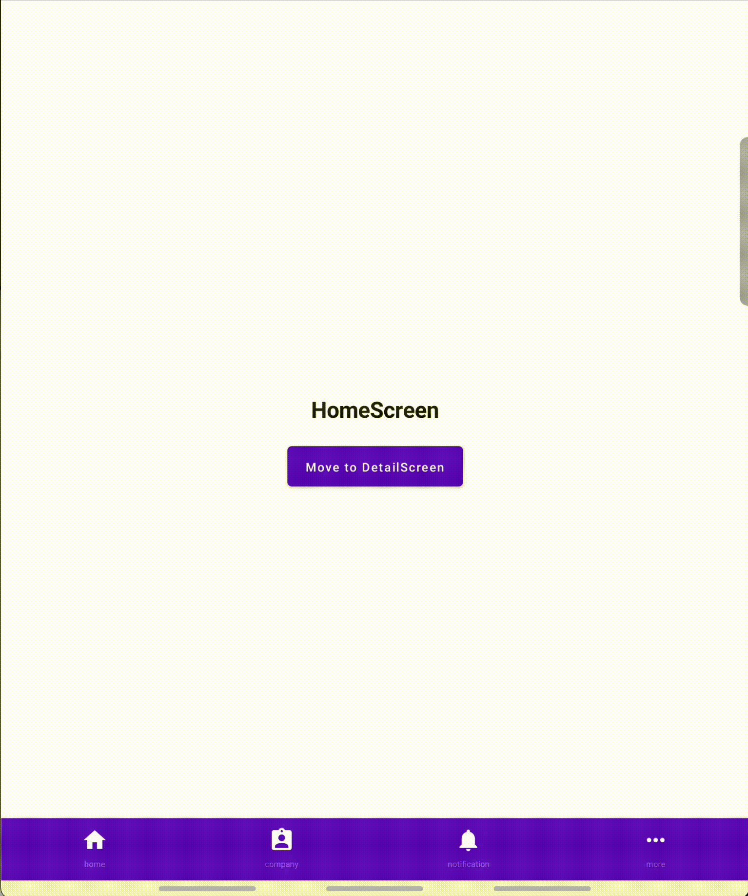
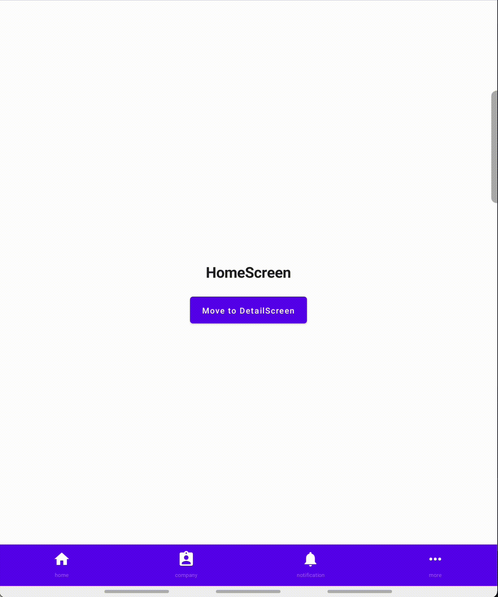

# Navigation Component Multiple BackStack

Example written in compose for managing multiple backstacks using navigation component and bottom
navigation

## Goal

1. It always takes the user back to the first tab irrespective for the order they were opened.
2. Separate the navigation graph for each tab
3. When BottomNavigation moves through each tab, it saves the state of the previous tab and restores
   the state when the previous tab is selected again.
4. If you press the selected tab once more, it moves to the root of the graph of the selected tab.

# Scenario

- Case 1
    - User Action
        - Click HomeTab -> Click CompanyTab -> Perform BackPressed
    - Result
        - HomeTab -> CompanyTab -> HomeTab
    - Preview
        - 
- Case 2
    - User Action
        - Click HomeTab -> Click CompanyTab -> Click NotificationTab -> Perform BackPressed
    - Result
        - HomeTab -> CompanyTab -> NotificationTab -> HomeTab
    - Preview
        - 
- Case 3
    - User Action
        - Click HomeTab -> Click CompanyTab -> Move to DetailScreen -> Click NotificationTab ->
          Click CompanyTab
    - Result
        - HomeTab -> CompanyTab -> Company DetailScreen -> NotificationTab -> CompanyDetailScreen
    - Preview
        - 
- Case 4
    - User Action
        - Click HomeTab -> Click CompanyTab -> Move to DetailScreen -> Move Company DetailScreen 2
          -> Click CompanyTab
    - Result
        - HomeTab -> CompanyTab -> CompanyDetailScreen -> CompanyDetailScreen2 -> CompanyTab(Root)
    - Preview
        - 
- Case 5
    - User Action
        - Click HomeTab -> Click CompanyTab -> Move to DetailScreen -> Move Company DetailScreen 2
          -> Click NotificationTab -> Click CompanyTab -> Click CompanyTab
    - Result
        - HomeTab -> CompanyTab -> CompanyDetailScreen -> CompanyDetailScreen2 -> NotificationTab ->
          CompanyDetailScreen2 -> CompanyTab(Root)
    - Preview
        - 
- Case 6
    - User Action
        - Click HomeTab -> Click CompanyTab -> Move to DetailScreen -> Move Company DetailScreen 2
          -> Click NotificationTab -> Click CompanyTab -> Perform BackPressed -> Perform BackPressed
          -> Perform BackPressed
    - Result
        - HomeTab -> CompanyTab -> CompanyDetailScreen -> CompanyDetailScreen2 -> NotificationTab ->
          CompanyDetailScreen2 -> CompanyDetailScreen -> CompanyTab(Root) -> HomeTab
    - Preview
        - 
